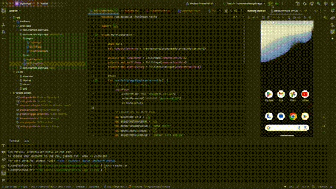

Here's a regular response with the content for your `README.md` file:

---

# **Sign-In App**

This repository contains the solution for the Senior Test Analyst (Android) coding challenge provided by TfL. The project demonstrates expertise in Android development, including automated testing and adherence to modern development practices.

---

## **Repository**

- **GitHub URL:** [Sign-In App](https://github.com/DavidLivingston/Sign-In-App)

---

## **Overview**

The Sign-In App provides a simple login flow with error handling and validation. It includes automated testing for key features and utilizes modern Android development principles like Jetpack Compose.

---

## **Demo Video**

Check out the demo video to see the app in action:  

> Replace the above link (`dQw4w9WgXcQ`) with the actual YouTube video ID of your demo video.

---

## **Project Structure**

```
├── app/                   # Main application code
├── build/                 # Build artifacts (ignored in git)
├── gradle/                # Gradle wrapper files
├── .gitignore             # Git ignore configuration
├── build.gradle           # Project-level build file
├── settings.gradle        # Project settings
├── README.md              # Project documentation
└── src/                   # Source code directory
    ├── main/              # Main application code
    ├── androidTest/       # Instrumented tests
    └── test/              # Unit tests
```

---

## **Setup Instructions**

### **Prerequisites**

- Android Studio `2024.2.1 Patch 2` or higher
- Java JDK 17 or above
- Gradle 8.5+
- Git

### **Steps to Run the Project**

1. **Clone the repository:**
   ```bash
   git clone https://github.com/DavidLivingston/Sign-In-App.git
   cd Sign-In-App
   ```

2. **Open in Android Studio:**
    - Launch Android Studio.
    - Select "Open an existing project" and navigate to the cloned repository.

3. **Sync Gradle:**
    - Allow Gradle to sync dependencies automatically.
    - Ensure there are no build errors.

4. **Run the App:**
    - Select a device/emulator.
    - Click the "Run" button to build and deploy the app.

5. **Execute Tests:**
    - To run instrumented tests:
      ```bash
      ./gradlew connectedAndroidTest
      ```
    - To run unit tests:
      ```bash
      ./gradlew test
      ```

---

## **Features**

- **Authentication:**
    - Validates login credentials.
    - Displays error messages for invalid credentials.

- **UI/UX:**
    - Designed with Jetpack Compose for modern UI.
    - Includes clear and intuitive navigation.

- **Automated Tests:**
    - Built using Espresso and Jetpack Compose Test Library.
    - Includes tests for successful and failed login scenarios.

---

## **Testing**

### **Manual Testing**
- Tested on Android Emulator API Level 34.
- Verified on multiple screen sizes for responsiveness.

### **Automated Testing**
- Comprehensive test cases for:
    - Login functionality.
    - UI component validation.
    - Navigation flows.

---

## **Project Details**

- **Language:** Kotlin
- **Frameworks & Tools:**
    - Jetpack Compose
    - Android Jetpack (Navigation, Lifecycle)
    - Espresso, JUnit for testing

---

## **Contact**

For any questions or issues, please feel free to reach out:

- **Name:** David Livingston Leons Suseelabai
- **Email:** davidlivingston.ls@gmail.com
- **GitHub:** [https://github.com/DavidLivingston](https://github.com/DavidLivingston)

---

## **License**

This project is created for the TfL Senior Test Analyst (Android) coding challenge and is not intended for distribution.

--- 